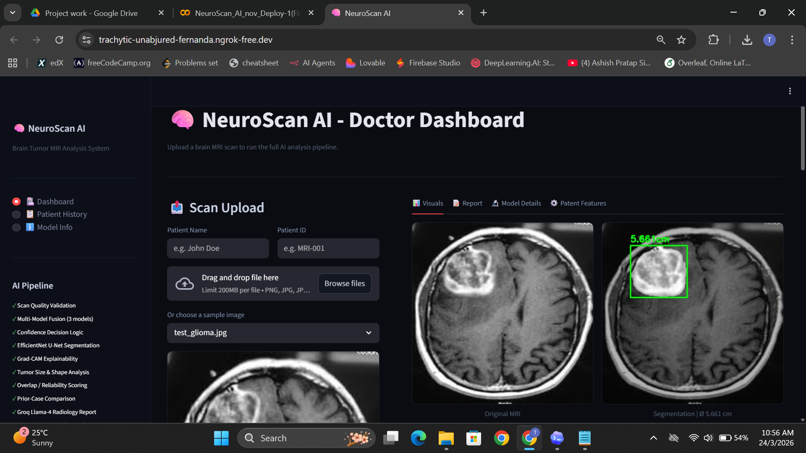
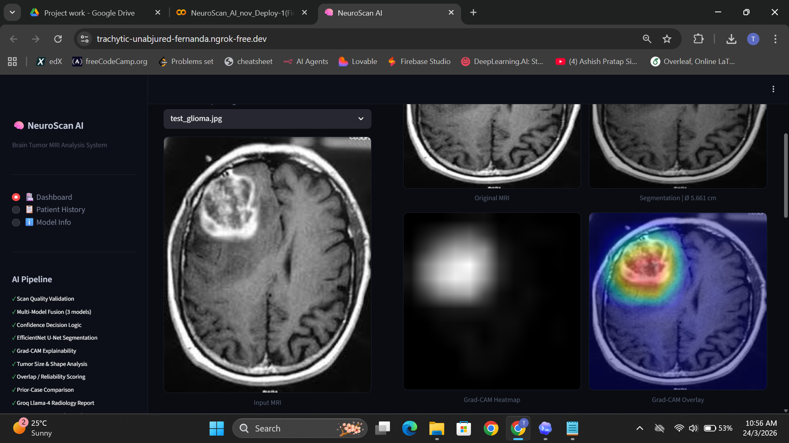
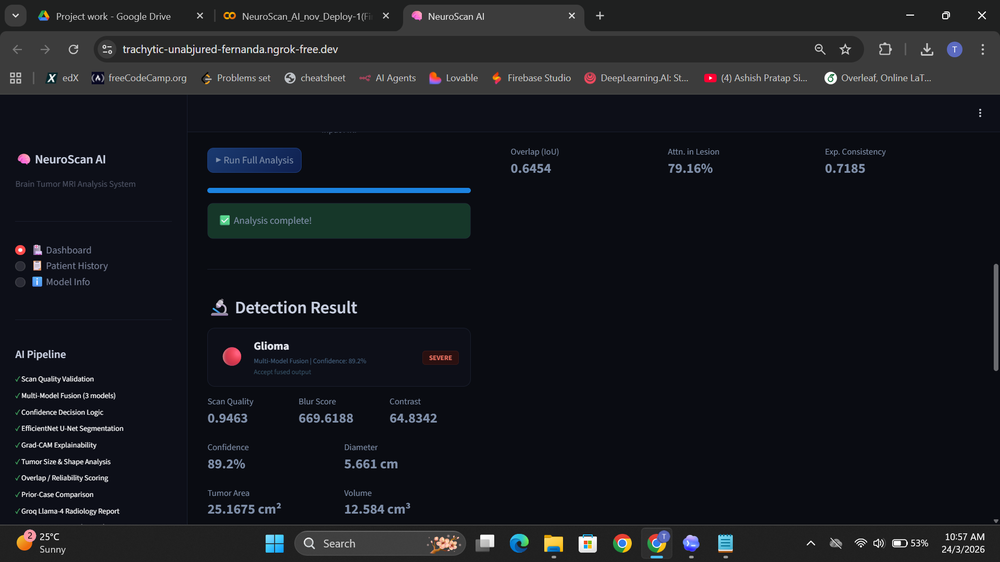
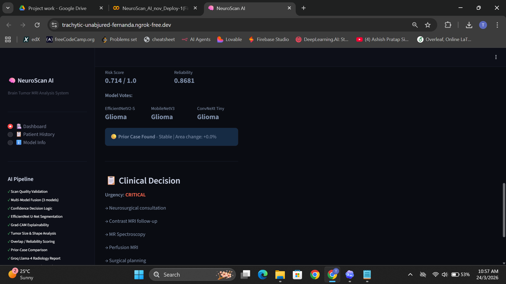
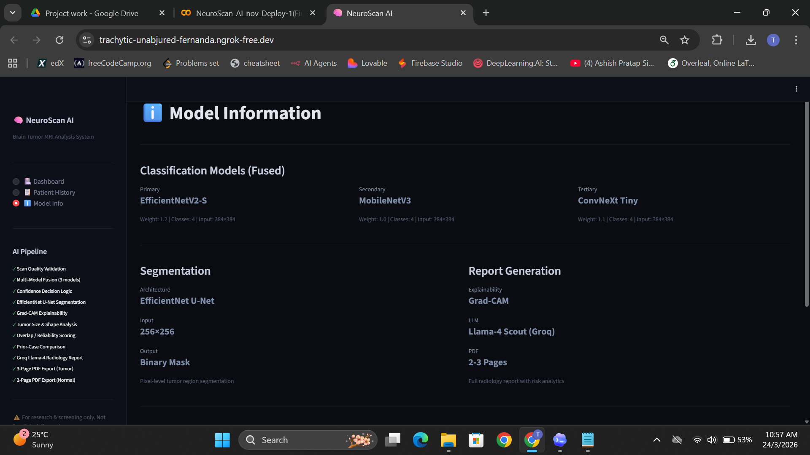

# NeuroScan AI API

A backend-oriented brain MRI analysis project built with FastAPI, modular Python analytics, and notebook-based model development workflows.

## Overview

NeuroScan AI API is a final-project style system for brain MRI tumor analysis. The repository combines:

- a FastAPI backend for structured request/response handling
- reusable analytics modules for scan quality, lesion measurement, shape analysis, overlap scoring, and risk scoring
- report generation utilities for structured radiology-style output
- Colab notebooks for classification, segmentation, experimentation, and deployment work

This project is intended as a clean academic and portfolio backend project. It is not presented as a production medical system or a clinically validated diagnosis platform.

## Key Features

- FastAPI backend with API-first design
- Real service structure separating API, analytics, core config, and services
- Honest model-availability handling without fabricating predictions in the API path
- Modular analysis pipeline for quality scoring, tumor size, shape irregularity, explainability overlap, and progression comparison
- Structured report generation with deterministic fallback reporting and optional Groq integration
- Pytest-style tests for API and service behavior
- Preserved notebook workflow for model experimentation and training research

## Tech Stack

- Python
- FastAPI
- Uvicorn
- NumPy
- Pillow
- TensorFlow
- OpenCV
- Matplotlib
- Pytest
- Groq API for optional report generation

## Repository Structure

```text
app/
  api/          # FastAPI routes and schemas
  analytics/    # Core analysis modules
  core/         # Config, logging, exceptions
  inference/    # Fusion and report-building helpers
  services/     # Image parsing, orchestration, model registry
  main.py       # FastAPI application entry point

tests/          # API and service tests
notebooks/      # Colab notebooks for experimentation and training
data/           # Sample inputs and example output assets
reports/        # Example generated PDF reports
docs/assets/    # README screenshots and visual references
```

## Backend Architecture

```text
Client Request
   -> FastAPI Route
   -> Image Parsing / Validation
   -> Analysis Service
   -> Analytics Modules
   -> Report Service
   -> JSON Response
```

## API Endpoints

### `GET /health`
Returns service health, version information, and current model availability.

### `POST /predict`
Accepts an MRI image and returns:
- quality metrics
- classifier prediction

If classifier model files are not configured locally, the endpoint returns `503` instead of generating fake predictions.

### `POST /analyze`
Accepts an MRI image and optionally:
- a segmentation mask
- a heatmap image
- prior case history JSON

Returns all available analysis sections, including warnings if some components cannot run because required models or inputs are missing.

### `POST /report`
Accepts completed analysis output and generates a structured radiology-style report.

## Visual Output Samples

### API Health And Docs


### Analysis Output Overview


### Analysis Details 1


### Analysis Details 2


### Report Output Example


## Local Setup

1. Create and activate a Python environment.
2. Install dependencies:

```bash
pip install -r requirements.txt
```

3. Copy `.env.example` to `.env` and update values if needed.
4. Start the API:

```bash
uvicorn app.main:app --reload
```

5. Open the interactive API docs:

```text
http://127.0.0.1:8000/docs
```

## Example Workflow

1. Call `/health` to confirm the API is running.
2. Call `/analyze` with an MRI image and optional mask.
3. Review JSON output for quality, tumor size, shape metrics, overlap, and warnings.
4. Pass the analysis payload to `/report` to generate a structured report.

## Testing

Run the test suite with:

```bash
pytest
```

The repository includes API-level and service-level tests, plus the original feature modules used during project development.

## Sample Assets

Sample MRI inputs are available in [`data/sample_inputs/`](data/sample_inputs/).
Example output screenshots are available in [`data/sample_outputs/`](data/sample_outputs/).
Example generated reports are available in [`reports/`](reports/).

## Project Notes

- The backend does not fabricate predictions in the real API execution path.
- If local model files are missing, the API responds honestly with warnings or unavailable status.
- Notebook files are preserved because they represent the training and experimentation workflow behind the project.
- This repository should be described as a backend-oriented MRI analysis prototype, not a production clinical system.

## Limitations

- Clinical validation is outside the scope of this project.
- Real deployment-grade model integration depends on locally available trained model files.
- Dataset quality and train/test leakage handling should be documented and improved before making performance claims.

## Future Improvements

- Integrate exported trained models directly into the FastAPI inference path
- Replace placeholder model registry logic with real runtime loading
- Add stricter validation and richer error reporting for file uploads
- Extend test coverage for failure modes and API edge cases
- Add authenticated access and persistence if the project evolves beyond final-project scope

## Resume-Friendly Summary

Built a modular brain MRI analysis backend using FastAPI and Python, with reusable analytics for quality scoring, lesion measurement, shape analysis, explainability overlap, progression comparison, and structured reporting. Organized the project into API, service, analytics, and notebook layers to improve maintainability and backend integration readiness.

## License

This repository is shared for academic, learning, and portfolio purposes unless a separate license is added.
